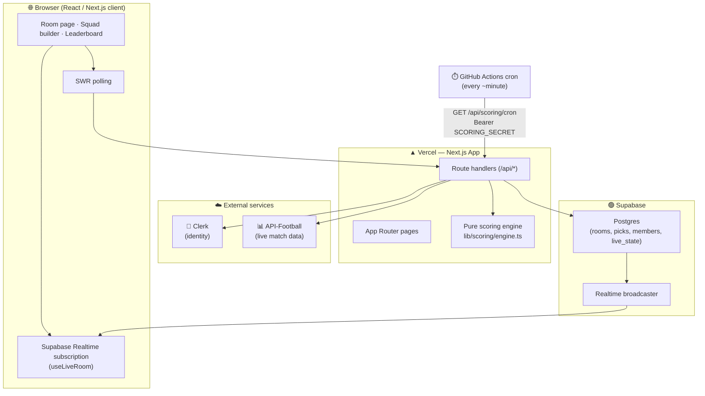
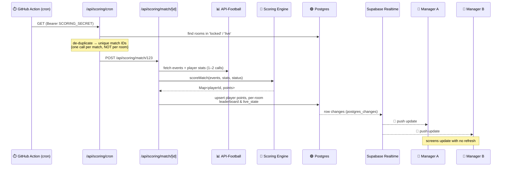
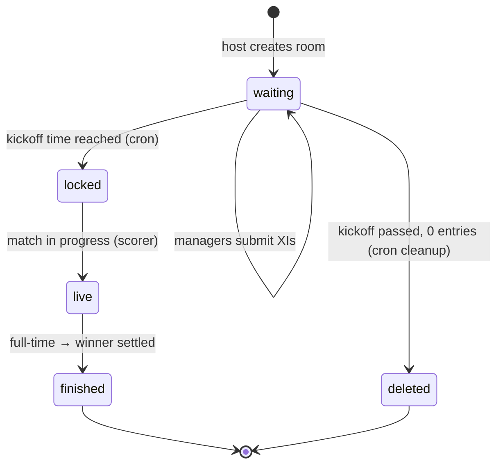

<div align="center">

# ⚽ WC26 Fantasy XI

### Real-time fantasy football for the FIFA World Cup 2026

*Pick your XI · Create private contests · Watch points score live, minute by minute*

[](https://nextjs.org/)
[](https://www.typescriptlang.org/)
[](https://supabase.com/)
[](https://clerk.com/)
[](https://vercel.com/)

</div>

---

## 📖 What is this?

**WC26 Fantasy XI** is a Dream11-style fantasy game built around a single real-world football tournament — the **FIFA World Cup 2026**. A host spins up a private contest room for a specific match, shares a join code, and up to **100 managers** each draft an **XI within a 100-credit budget**. Once the match kicks off, the room locks and **every touch on the pitch turns into points in real time** — goals, assists, tackles, clean sheets, cards — streamed to every manager's screen without a single page refresh.

The hard part of a fantasy app isn't the UI — it's **getting live football data to score fairly and fan it out to many viewers efficiently**. That's where the architecture below comes in.

---

## ✨ Key Features

| | |
|---|---|
| 🏟️ **Match-scoped contests** | Each room is tied to one World Cup fixture. Create, share a code, fill up to 100 managers. |
| 👕 **Budget squad builder** | Draft 11 players under a 100-credit cap with a captain (×2) and vice-captain (×1.5). |
| 💸 **Form-based pricing** | Player credits are computed from real club-season **and** World Cup form — not flat by position. |
| 📡 **Live scoring** | Points update minute-by-minute during a match via a pub/sub fan-out + Supabase Realtime. |
| 🏆 **Live leaderboard** | Rooms rank managers in real time; the winner is settled at full-time. |
| 📰 **WC news + fixtures** | Aggregated World Cup news feed, fixtures, standings, Golden Boot race. |
| 🔐 **Frictionless auth** | Email-code sign-in via Clerk — no passwords. |

---

## 🧱 Tech Stack

| Layer | Choice | Why |
|---|---|---|
| **Framework** | Next.js 14 (App Router) + TypeScript | Server routes + React in one deploy unit |
| **Styling** | Tailwind CSS | Fast, consistent design tokens |
| **Client data** | SWR | Polling + cache for live-ish UI state |
| **Database** | Supabase (Postgres) | Relational store with row-level security |
| **Realtime** | Supabase Realtime (`postgres_changes`) | The pub/sub transport to browsers |
| **Auth** | Clerk | Passwordless email-code, hosted UI |
| **Football data** | API-Football (`api-sports.io`) | Fixtures, lineups, live events & player stats |
| **Hosting** | Vercel | Native Next.js host |
| **Scheduler** | GitHub Actions | Free cron that drives live scoring (no Vercel Pro) |

---

## 🏗️ System Architecture



**The flow in one sentence:** the browser reads/writes through Next.js API routes (authenticated by Clerk, persisted in Postgres), while a GitHub Actions cron repeatedly pokes the scoring engine, which pulls live data from API-Football, writes results to Postgres, and lets **Supabase Realtime push those changes straight to every open browser.**

---

## 📡 The Pub/Sub Live-Scoring Engine *(the heart of the app)*

A naive design would have every browser poll API-Football directly — that explodes the API rate limit (300 req/min) and double-counts work. Instead, scoring uses a **publish/subscribe fan-out** so that **one API fetch per match** updates **unlimited viewers**.

### The publishers and subscribers



### Why this is efficient

- 🎯 **One fetch per match, not per room.** The cron collects every active room, reduces them to **unique match IDs**, and calls the scorer **once** per match. 100 rooms playing the same game = **1** API-Football call.
- 📤 **Postgres *is* the message bus.** The scorer only ever **writes** to the database. It never talks to browsers. Supabase Realtime watches those tables (`postgres_changes`) and **publishes** every change to subscribed clients — classic pub/sub, with the DB as the broker.
- 📥 **Browsers just subscribe.** [`lib/hooks/useLiveRoom.ts`](lib/hooks/useLiveRoom.ts) opens a Realtime channel per room and receives pushes. No polling of the football API from the client, ever.
- 🩹 **Self-healing rooms.** When a manager has a room open, [`/api/room/[roomId]/sync`](app/api/room/[roomId]/sync/route.ts) also nudges scoring every ~30s — so open rooms progress even between cron ticks. The cron is the safety net for rooms nobody is watching.

### Scoring correctness: live vs. full-time

The engine ([`lib/scoring/engine.ts`](lib/scoring/engine.ts)) is a **pure function** — no DB, no network — which makes it trivially testable. It deliberately splits scoring into two phases:

| Phase | What's scored | Why |
|---|---|---|
| **Live (during play)** | Timed match events: goals, assists, cards, own goals, missed penalties, appearances — each at its **true minute** | These have a real timestamp from API-Football and never change once they happen |
| **Full-time only (FT/AET/PEN)** | Cumulative stats: tackles, interceptions, passes, chances created, saves, **clean sheets**, goals conceded | These are running aggregates with no event time — awarding them live would make a clean sheet appear at 30' and vanish at 70', and make the points-log "minute" drift to the live clock every tick |

The result: the leaderboard moves in real time on the things that *are* final (goals win matches), while bonus/defensive points are settled cleanly when the whistle blows — exactly like real fantasy platforms.

<details>
<summary><b>📋 Full points table</b></summary>

| Action | Points |
|---|---|
| Goal (FWD / MID / DEF·GK) | +40 / +50 / +60 |
| Assist | +20 |
| Shot on target | +6 |
| Chance created (key pass) | +3 |
| Pass completion (per 5) | +1 |
| Tackle won / Interception | +4 each |
| Save (GK) | +6 |
| Penalty saved (GK) | +50 |
| Clean sheet (GK/DEF, 54'+) | +20 |
| Starting XI / Sub appearance | +4 / +2 |
| Yellow / Red card | −4 / −10 |
| Own goal | −8 |
| Goal conceded (GK/DEF) | −2 each |
| Missed penalty | −20 |
| **Captain / Vice-captain multiplier** | **×2 / ×1.5** |

</details>

---

## 🔄 Room Lifecycle



- **Entry = a submitted team.** A manager only joins a room's leaderboard when they save a full, valid 11-player XI — so abandoned/empty joiners can never appear as "0-point winners."
- **Empty-room cleanup.** If a room reaches kickoff with no entries, the cron deletes it — a contest nobody joined can't be played.
- **Host controls.** The host can remove a manager before kickoff via [`/api/room/[roomId]/members`](app/api/room/[roomId]/members/route.ts).

---

## 💸 Player Pricing

Credits are **earned, not assigned by position**. [`lib/pricing.ts`](lib/pricing.ts) computes a Dream11-style value (≈7.5–12.5) by blending:

1. **Club-season form** — minutes-weighted rating, goal involvement per 90, output volume, starter bonus.
2. **World Cup form overlay** — recent tournament rating delta, goals and assists in WC 2026.

Prices are cached in a `player_prices` table (refreshed every few hours) so they move between matchdays without hammering the API. ([`lib/api/playerPrices.ts`](lib/api/playerPrices.ts) resolves a whole squad with bounded concurrency.)

---

## 🗂️ Project Structure

```
app/
├── page.tsx                     # Home: live ticker, Golden Boot, news
├── opengraph-image.tsx          # Dynamic social card (next/og)
├── icon.tsx / apple-icon.tsx    # Dynamic favicons
├── fantasy/
│   ├── page.tsx                 # Lobby: my rooms + join-by-code
│   ├── login / signup           # Clerk hosted auth
│   └── room/
│       ├── create               # New contest for a fixture
│       └── [roomId]/
│           ├── page.tsx         # Participants → live leaderboard
│           ├── pick             # Squad builder (budget, C/VC)
│           └── team             # View a manager's XI
├── fixtures/                    # Fixtures, match detail, points log
└── api/
    ├── room/                    # create · join · picks · members · sync
    ├── scoring/                 # cron (dispatcher) · match/[id] (worker)
    └── wc/                      # API-Football proxies (cached)

lib/
├── scoring/engine.ts            # ⭐ pure scoring function
├── api/apifootball.ts           # API-Football client (cached fetch)
├── api/playerPrices.ts          # form-based credit resolver
├── pricing.ts                   # credit formula
├── hooks/useLiveRoom.ts         # ⭐ Supabase Realtime subscription
├── hooks/useFixtures.ts         # live/today/upcoming fixtures
└── auth.ts                      # Clerk server helpers

supabase/                        # schema + migrations + ops scripts
.github/workflows/scoring-cron.yml  # ⭐ the cron that drives scoring
```

---

## 🔌 API Routes

<details>
<summary><b>Fantasy & scoring</b></summary>

| Route | Method | Purpose |
|---|---|---|
| `/api/room/create` | POST | Create a contest + join code |
| `/api/room/join` | POST | Resolve a code/ID and validate |
| `/api/room/[roomId]/picks` | POST | Save an XI = **enter the room** |
| `/api/room/[roomId]/members` | DELETE | Host removes a manager (pre-kickoff) |
| `/api/room/[roomId]/sync` | POST | Self-heal: lock + nudge scoring |
| `/api/scoring/cron` | GET | **Dispatcher** — fan out to active matches |
| `/api/scoring/match/[id]` | POST | **Worker** — fetch, score, write, fan out |

</details>

<details>
<summary><b>World Cup data (API-Football proxies, cached)</b></summary>

| Route | Purpose |
|---|---|
| `/api/wc/fixtures`, `/api/wc/friendlies` | Fixture lists |
| `/api/wc/match/[id]`, `/api/wc/events/[id]` | Match detail & events |
| `/api/wc/lineups/[id]` | Confirmed XI + **priced** player pool |
| `/api/wc/player-points/[id]` | Live per-player points strip |
| `/api/wc/standings`, `/api/wc/topscorers` | Tables & Golden Boot |
| `/api/wc/team/[id]`, `/api/wc/teams` | Team info |
| `/api/news` | Aggregated WC news RSS |

</details>

---

## 🚀 Getting Started

### Prerequisites
- Node.js 18+
- Accounts: [Supabase](https://supabase.com), [Clerk](https://clerk.com), [API-Football](https://www.api-football.com)

### Local development

```bash
# 1. Install
npm install

# 2. Configure environment
cp .env.local.example .env.local
#    → fill in the keys (see table below)

# 3. Set up the database
#    In the Supabase SQL Editor, run supabase/verify-schema.sql to see what's
#    needed, then the migration files in supabase/ (date order).

# 4. Run
npm run dev          # http://localhost:3000
```

### Environment variables

| Variable | Description |
|---|---|
| `NEXT_PUBLIC_SUPABASE_URL` / `NEXT_PUBLIC_SUPABASE_ANON_KEY` | Supabase project (client) |
| `SUPABASE_SERVICE_ROLE_KEY` | Server-only writes (bypasses RLS) |
| `NEXT_PUBLIC_CLERK_PUBLISHABLE_KEY` / `CLERK_SECRET_KEY` | Clerk auth |
| `APIFOOTBALL_KEY` | API-Football (server) |
| `NEXT_PUBLIC_APIFOOTBALL_KEY` | API-Football (embeddable widget only) |
| `SCORING_SECRET` | Shared secret protecting the scoring cron |
| `NEXT_PUBLIC_BASE_URL` | App URL the cron uses to call itself |

---

## ☁️ Deployment (Vercel + free cron)

1. **Import the repo into Vercel** → add all environment variables (Production scope) → deploy.
2. **Set `NEXT_PUBLIC_BASE_URL`** to the deployed URL, then redeploy.
3. **Drive scoring with GitHub Actions** (no Vercel Pro needed) — [`.github/workflows/scoring-cron.yml`](.github/workflows/scoring-cron.yml) pings the scoring cron every cycle. Add repo secrets:
   - `SCORING_BASE_URL` — your prod URL (no trailing slash)
   - `SCORING_SECRET` — same value as in Vercel

   > ℹ️ GitHub's minimum schedule is 5 min; the workflow loops internally to ping roughly once a minute. Actions minutes are **free & unlimited on public repos**.

See [`DEPLOYMENT.md`](DEPLOYMENT.md) for the full production checklist.

---

## 🧠 Design Highlights — *why it's built this way*

- **The database is the message broker.** Decoupling the scorer (writer) from browsers (subscribers) via `postgres_changes` means scoring scales independently of viewer count.
- **One API call per match.** De-duplicating rooms → match IDs keeps usage far under the 300 req/min limit, no matter how popular a fixture is.
- **A pure scoring engine.** No I/O inside `scoreMatch()` → deterministic, unit-testable, and the single source of truth shared by live rooms and the points-log UI.
- **Live vs. full-time scoring split.** Honest, drift-free points: real-time where it's final, settled at the whistle where it's cumulative.
- **Defense in depth on secrets.** The service-role key and `SCORING_SECRET` are server-only; the cron endpoint authenticates every call.

---

<div align="center">

*Built for the FIFA World Cup 2026 ⚽ · Not affiliated with FIFA.*

</div>
